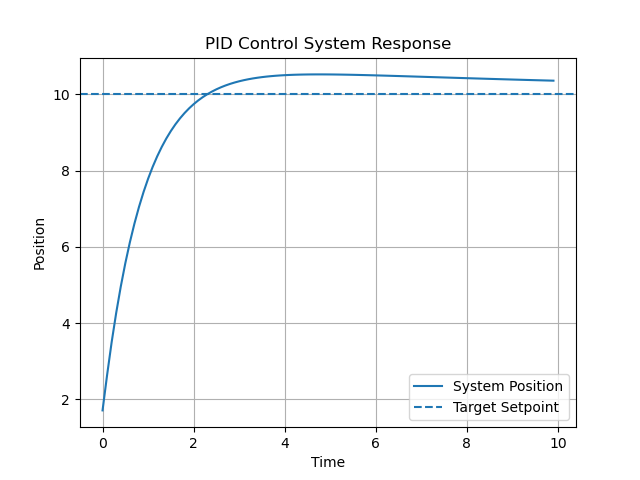

# ARC Control Systems

ARC Control Systems is the control and stabilization module for the ARC robotics stack.

This repository focuses on PID control, system response, disturbance correction, and basic mechatronics-style simulations. It is designed to connect later with the core simulation environment from `arc-core-simulation`.

## Project Goals

- Build a basic PID controller
- Simulate system response over time
- Analyze overshoot, settling time, and steady-state error
- Add disturbance response testing
- Create a foundation for drone, motor, and robotic stabilization experiments

## Why This Project Matters

Robotics systems do not only need path planning. They also need control systems that allow motors, drones, arms, and mobile robots to move accurately and remain stable.

This project focuses on the control layer of the ARC robotics stack.

## Planned Features

- PID controller implementation
- Step response simulation
- Overshoot and settling time analysis
- Disturbance response simulation
- Control tuning experiments
- Future connection to robot movement and navigation modules

## Tech Stack

- Python
- NumPy
- Matplotlib
- Control systems concepts
- Mechatronics simulation concepts

## Current Status

Initial repository created.

Next step: add a basic PID controller simulation.

## How to Run

Install dependencies:

    pip install -r requirements.txt

Run the PID control simulation:

    PYTHONPATH=. python3 examples/run_pid_simulation.py

## Demo Output

### PID Control System Response

This simulation shows a PID controller moving a system toward a target setpoint over time.

## Current Features

- Basic PID controller implementation
- Step response simulation
- Target setpoint tracking
- Visualization using Matplotlib
